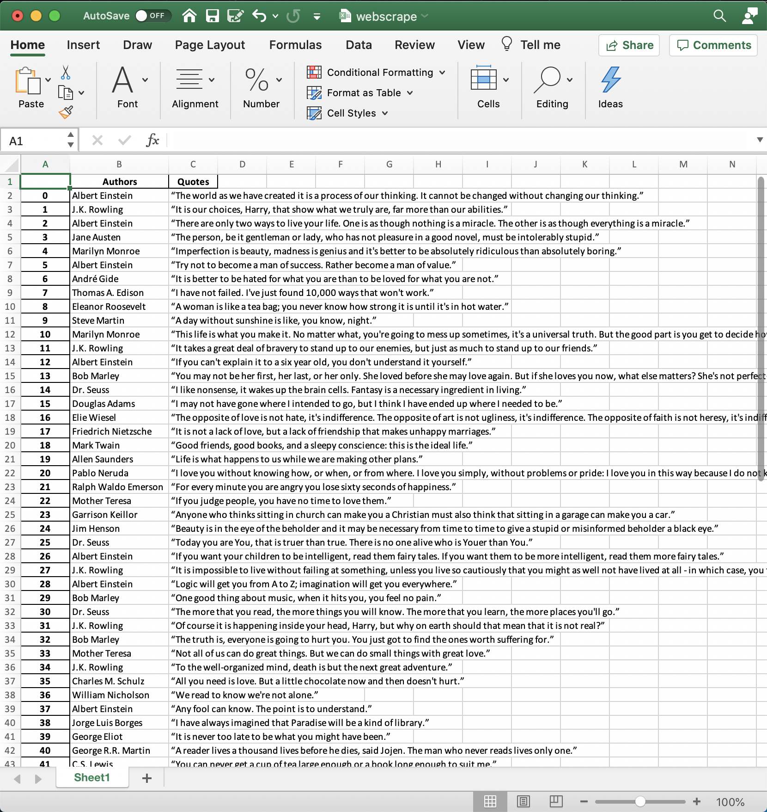

# python-webscrape

## Description
To familiarize myself with Python, I followed this [tutorial](https://towardsdatascience.com/how-to-collect-data-from-any-website-cb8fad9e9ec5) to learn how to scrape data from websites using Python. Data was scraped from this [website](http://quotes.toscrape.com/). From the pandas [docs](https://pandas.pydata.org/pandas-docs/stable/reference/api/pandas.DataFrame.to_excel.html), I was able to make the app export the data to an Excel .xlsx file. 


## Setup
#### Setup virtual environment...
- `python3 -m venv .venv`
- `source .venv/bin/activate`
- In VSCode, select your new environment by using the `Python: Select Interpreter` command from the Command Palette (Shift+Cmmd+P). (Should already be selected as ./.venv/bin/python3)
#### Install packages in the environment
- `pip install beautifulsoup4 pandas requests openpyxl`
- No need to pip install `time` and `random` as they are default modules in the python library; just `import time`, `import random`
#### Run the app
- `python3 webscrape_execution.py`
- In VSCode, press the play button in your virtual environment


## What I learned about Python 3: 
- The power and ease of using python (statistics, graphs, scraping data, etc.)
- Using virtual environments with Python and installing packages within them to prevent polluting the global environment. 
- `len()` to get length of an array
- Variations of the `for` loop
- `.extend()` vs `.append()` https://stackoverflow.com/questions/252703/what-is-the-difference-between-pythons-list-methods-append-and-extend
```
authors.extend([i.text for i in html.find_all(class_='author')])
```
- use of f-String (similar to Javascript's template literals)
```
urls = [f"http://quotes.toscrape.com/page/{i}" for i in range(1, 11)]
```
- Filtering DOM elements by class with `.find_all(class_='author')`
- And more!!! Much more to learn about Pythonx3🐍🐍🐍~! 